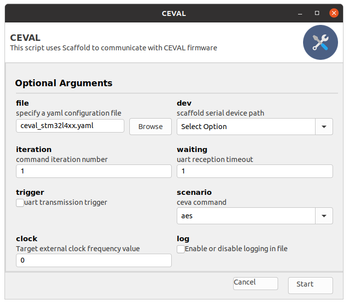

# Test CEVAL firmware on stm32lxx target

## pre-requisite
Install external packages. Use the requirements file in the script directory.

```commandline
pip install -r requirements.txt
```
plug the selected (e.g. stm32l462) daughter-board, power-on the scaffold-donjon and using stmloader cli, 
execute the following command:

- Target full erase:
```commandline
stmloader loader reset get -i command erase --mode mass
```
- Download the target firmware:
```commandline
stmloader loader reset write ./firmwares/ceval_stm32l462_0.1.0.hex
```
> A reset timing option can be necessary according to the target 

## Usage
executing the script, launch a user interface:



First, power-on the scaffold board. Select the scaffold device path (The script create an option list showing 
all serial device path found) and enable the uart trigger.


The script configuration file contain the supported command options. 
Select **aes** command and press the **Start** button


## traces
At low level, the previous execution give the following trace:


- Channel 0/1 are the uart channel
- Channel 2 is the target PC0 signal generated by the firmware
- Channel 3 is the scaffold uart trigger 
